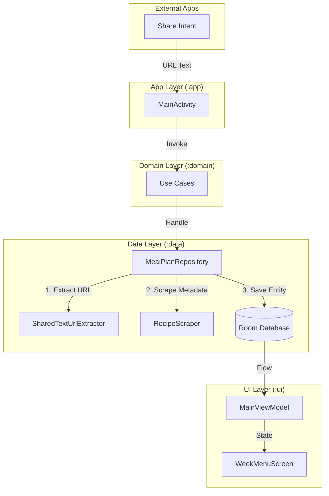
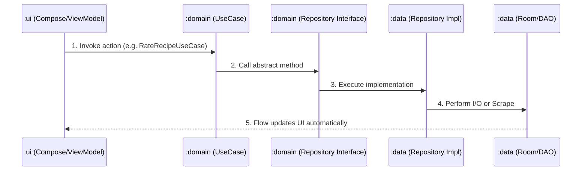

# Appetijt (v1.0.0-MVP)

Appetijt is a privacy-focused, local-first Android application designed to help you manage your weekly meal plan. It specializes in seamless ingestion of recipes from third-party apps via the Android 'Share' intent, allowing you to curate your culinary life without external accounts or data tracking.

## Core Features

-   **'t Archief (The Archive)**: A searchable culinary library of every recipe you've ever planned. Easily browse your history and clone recipes back onto your current weekly schedule.
-   **Seamless Ingestion**: Share a recipe link from any app (Colruyt XTRA, Dagelijkse Kost, Njam, HelloFresh, etc.) directly to Appetijt.
-   **Automated Scraping & Sanitization**: Automatically extracts titles and thumbnails from shared URLs with OWASP-aligned HTML sanitization to prevent XSS.
-   **Privacy First**: All data is stored locally in a Room database. No accounts, no cloud, no tracking.
-   **Modern Interaction**: Manage your week with intuitive swipe-to-dismiss actions and "Quick-Shift" dialogs to move meals between days instantly.
-   **Visual Identity**: A polished, retro-inspired UI featuring **Fraunces** typography and a tan/gold "Harvest" theme that adapts to light and dark modes.

## Architecture & Data Flow

Appetijt is built using a Multi-Module Clean Architecture approach, ensuring high maintainability and testability.



## Tech Stack

-   **Language**: Kotlin 1.9+
-   **UI**: Jetpack Compose (Material 3)
-   **Database**: Room (Local SQLite)
-   **Network/Scraping**: OkHttp3 + Jsoup
-   **Image Loading**: Coil
-   **Testing**: JUnit 4, MockK, Turbine, Robolectric (SDK 33 pinned)

## Project Structure

-   `:app`: Entry point, Activity lifecycle, and manual DI container.
-   `:data`: Room Entities, DAOs, Network Scrapers, and Repository implementations.
-   `:domain`: Pure Kotlin business logic, Use Cases, and Repository interfaces.
-   `:ui`: Reusable Compose components, Themes (Fraunces), and Screen state management.

## Development Guide: Adding a Feature

To maintain the architectural integrity of Appetijt, follow this flow when adding new functionality (e.g., a "Rate Recipe" feature):



1.  **Define the Requirement**: If it involves data, start in `:domain` by defining a new `UseCase` and adding the necessary method to `MealPlanRepository` (the interface).
2.  **Implement Logic**: In `:data`, update `MealPlanRepositoryImpl` to handle the new logic. Update Room Entities/DAOs if needed.
3.  **Update UI State**: In `:ui`, add the corresponding action to the `ViewModel`. The `ViewModel` should update the `StateFlow` which the Compose screens observe.
4.  **Verify**: Every new path in `:data` or `:ui` should have a corresponding unit test to maintain the 90%+ coverage.

## Quality & Testing

Appetijt maintains a high standard of quality with over **90% logic coverage** across all modules.

-   **Total Tests**: 108 passing tests.
-   **Environment**: Optimized for JDK 21 with `-noverify` and JVM internal API exposures for stable Robolectric instrumentation.

### Running Tests
To run the full suite with coverage:
```bash
./gradlew test
```

## Getting Started

### Prerequisites
- Android Studio Ladybug (or newer)
- **JDK 21** (Required for build and test stabilization)

### Building
```bash
./gradlew assembleDebug
```

## License

Appetijt is free software: you can redistribute it and/or modify it under the terms of the GNU General Public License as published by the Free Software Foundation, either version 3 of the License, or (at your option) any later version.

See the [LICENSE](LICENSE) file for details.
